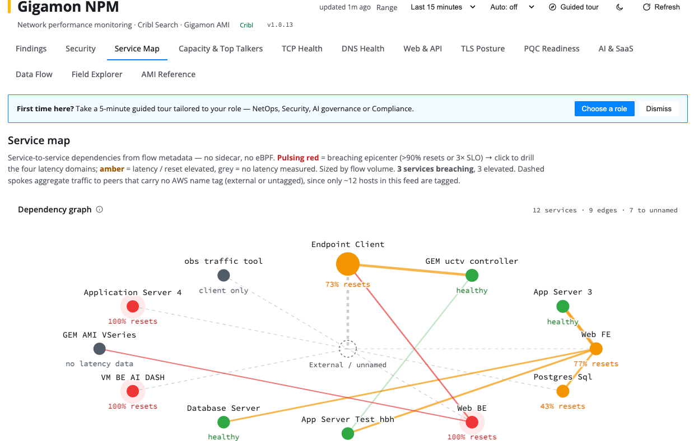
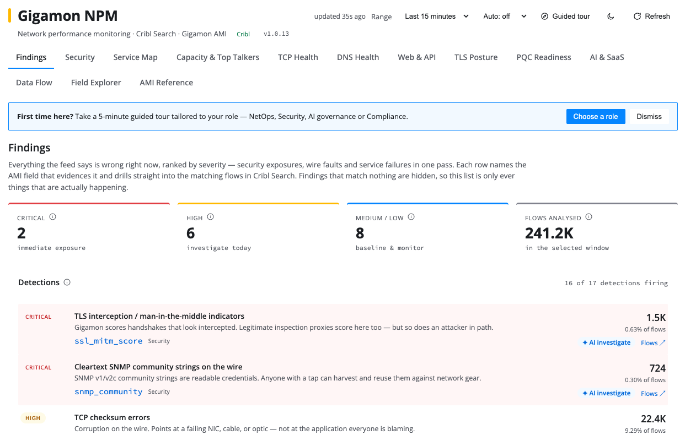

# Gigamon AMI

[](https://github.com/Cribl-Community/cc-gigamon-ami/actions/workflows/release.yml)

A Cribl App that turns **Gigamon Application Metadata Intelligence (AMI)** flow records into a
network-performance-monitoring dashboard. It runs [Cribl Search](https://docs.cribl.io/search/)
(KQL) jobs against the `gigamon_ami` dataset in [Cribl Lake](https://docs.cribl.io/lake/) and
renders the results across focused tabs — service dependencies, TCP/DNS/TLS health, capacity and
top talkers, security findings, and more — without moving the data anywhere.



## Why

Gigamon AMI emits rich Layer 4–7 metadata (hundreds of fields per flow: service names, TCP/DNS/TLS
attributes, byte and latency counters, application identities). That firehose is only useful if you
can *ask questions of it*. This app ships a set of purpose-built, drill-down dashboards on top of
Cribl Search so you can explore AMI data where it already lives in Cribl Lake — and jump straight
into the raw Cribl Search UI whenever you want to go deeper.

## What it does

1. **Onboard the data (Guided Setup).** Idempotently provisions a real-world Gigamon syslog
   onboarding stack — a Syslog source, a parse/normalize pipeline, a route, and the `gigamon_ami`
   Cribl Lake dataset — in the `default` Stream group, then commits and deploys it. It only *adds*
   resources (never edits shared ones) and can tear down exactly what it added.
2. **Query on demand.** Each tab issues KQL jobs against `dataset="gigamon_ami"`, polls to
   completion, and streams the result rows into the view. A global time range and auto-refresh
   interval drive every panel at once.
3. **Explore and drill down.** Rows and tiles deep-link into the real Cribl Search UI (and Cribl
   Investigate) so any dashboard number is one click away from the underlying events.
4. **Stay read-only.** Apart from Guided Setup provisioning (deliberate, idempotent, and
   user-triggered), the app never writes to your Cribl config or data.



## Features

The dashboard is organized into tabs, each answering a different operational question:

- **Service Map** — service-to-service dependencies and traffic relationships (default landing tab)
- **Capacity & Top Talkers** — throughput, byte volumes, and the busiest hosts/services
- **TCP Health** — retransmits, resets, and connection-quality signals
- **DNS Health** — query volumes, response codes, and latency
- **Web & API** — HTTP/API activity and status-code distributions
- **TLS Posture** — protocol versions, cipher suites, and certificate signals
- **PQC Readiness** — post-quantum cryptography readiness of observed TLS
- **AI & SaaS** — shadow-AI and SaaS application usage
- **Data Flow** — end-to-end flow-level view of the traffic
- **Security** & **Findings** — security-relevant observations surfaced from the metadata
- **Field Explorer** — browse the AMI field schema and per-field summaries
- **AMI Reference** — reference documentation for the Gigamon AMI dataset
- **Guided Setup** — provision (or tear down) the syslog → Lake onboarding stack

## Installation

> **Install from the packaged release, not from Git.** This repository holds the app's
> **source code**. Cribl's "Import from Git" only works when the repo contains the *built bundle* —
> importing a source repo installs the app record but leaves it unable to load ("App not found").
> Use the release `.tgz` instead.

1. Download the latest `cc-gigamon-ami-<version>.tgz` from the
   [Releases page](https://github.com/Cribl-Community/cc-gigamon-ami/releases/latest).
2. Log in to Cribl and click **Apps → View All**.
3. Click **Add App → Upload package** and select the downloaded `.tgz`.
4. Click **Install**.

Once installed, open the app and start on the **Guided Setup** tab if the `gigamon_ami` dataset
does not yet exist in your environment.

## Development

```bash
npm install
npm run dev      # start the Vite dev server (port 5173)
npm run lint     # oxlint
npm run build    # type-check + production build
npm run package  # build + create build/<name>-<version>.tgz
```

`npm run dev` talks to a real Cribl API through the Vite proxy using client credentials in the
gitignored `.dev/cribl.json`; without that file, Search calls are inert. See
[`CLAUDE.md`](./CLAUDE.md) and [`AGENTS.md`](./AGENTS.md) for the full developer guide
(runtime detection, fetch proxy, KV store, `proxies.yml` / `policies.yml`, and Capra UI rules).

## Releasing

Releases are cut by pushing a `v*` tag. The workflow at
[`.github/workflows/release.yml`](./.github/workflows/release.yml) runs `npm ci`, lints, packages
the app at the tag's version (`v1.0.17` → `1.0.17` via `--version`), publishes a GitHub Release with
the built `cc-gigamon-ami-<version>.tgz` attached, and uploads the pack to the Cribl Packs
Dispensary.

**Test on staging first.** Append `-staging` to the tag to publish to the staging dispensary only;
a clean tag publishes to prod.

```bash
# 1. Bump package.json (+ lockfile) and commit it to main.
npm version 1.0.17 --no-git-tag-version
git commit -am "Release v1.0.17"
git push origin main

# 2. Sanity-check the package build locally.
npm ci && npm run lint && npm run package -- --version 1.0.17
ls build/*.tgz

# 3a. Staging dry run — uploads to the staging dispensary only.
git tag v1.0.17-staging
git push origin v1.0.17-staging

# 3b. Once verified, cut the prod release.
git tag v1.0.17
git push origin v1.0.17
```

`package.json` version and the `v*` tag should agree so the packaged app reports the right version.
To retag, delete the bad tag locally and on the remote first:

```bash
git tag -d v1.0.17
git push origin :refs/tags/v1.0.17
```

## Authors

- **[jpederson@cribl.io](mailto:jpederson@cribl.io)** — original author and creator of the Gigamon AMI
  app: the dashboards, Cribl Search integration, and the Guided Setup provisioning workflow.
- **[bwooden@cribl.io](mailto:bwooden@cribl.io)** — Guided Setup provisioning UX improvements and the
  Cribl Marketplace release/packaging setup.

## License

Licensed under the [Apache License 2.0](./LICENSE).
